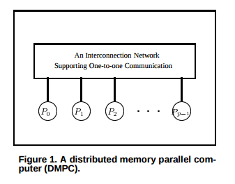

## Outline
- Statistics Background
- Load Balanced Sparse Matrix-Multiplication
- Architecture-aware Technique
- Scalable Parallel Matrix Multiplication

## Statistics Background
In matrix/vector notation, we can define a typical linear model in statistics as:

$y = X\beta + \epsilon$

Where:

- y is an $n \times 1$ response vector
- X is an $n \times k$ design matrix
- $\beta$ is a $k \times 1$ parameter vector
- $\epsilon$ is an $n \times 1$ error vector (that is, $\epsilon \sim MVN(0, \Sigma)$)

## Least Squares Estimator
The "Least Squares Estimator" of the parameter vector $\beta$ is given by $b = (X^TX)^{-1}X^Ty$

## A Simple Example
Suppose we have the data given in the following table:
```{r, echo=FALSE, results='asis'}
library(ggplot2)
library(xtable)

print(xtable(mpg[1:5,c("cty", "hwy")], digits = 0), comment = FALSE, type = "html")
```

We wish to use the highway mpg to predict the city mpg.

## A Simple Example (Continued)
Then we have:

$y = \begin{bmatrix}
        18 & 21 & 20 & 21 & 16
     \end{bmatrix}^{T}$
     
$X = \begin{bmatrix}
        1 & 29 \\
        1 & 29 \\
        1 & 31 \\
        1 & 30 \\
        1 & 26
     \end{bmatrix}$
     
$\beta = \begin{bmatrix}
        \beta_0 \\
        \beta_1
     \end{bmatrix}$
     
$\epsilon = \begin{bmatrix}
        \epsilon_1 & \epsilon_2 & \epsilon_3 & \epsilon_4 & \epsilon_5
     \end{bmatrix}^{T}$
     
## A Simple Example (Continued)
$(X^TX)^{-1} = \begin{bmatrix}
        60.2714 & -2.0714 \\
        -2.0714 & 0.0714 \\
     \end{bmatrix}$
     
$X^Ty = \begin{bmatrix}
        96 \\
        2797 \\
     \end{bmatrix}$
     
$b = (X^TX)^{-1}X^Ty = \begin{bmatrix}
        -7.7286 \\
        0.9286 \\
     \end{bmatrix}$
     
Hence, the equation for the line of best fit is given by $y = -7.7286 + 0.9286x$.

## SpMV Calculations
Note one of the key operations here is multiplying $X^T$ by $y$. In this example, it was almost trivial, but in general, the matrix $X$ can be very large and sparse. 

In particular, there is a column in $X$ for every parameter in the parameter vector.

## R Simulation
```{r, eval=FALSE}
wearables <- read.csv("data/Example_WearableComputing_weight_lifting_exercises_biceps_curl_variations.csv")
X <- apply(wearables[,-1], 2, as.numeric)
y <- as.numeric(wearables[,1])

biggerX <- do.call("rbind", replicate(50, X, simplify = FALSE))
biggery <- rep(y, times = 50)

t(X) %*% y
t(biggerX) %*% biggery
```

## Limitations of the R (and naive) implementation
- No explicit parallelism (only thread level) by default
- Even if it was explicitly parallel, no load balancing or processor communication
- Choice of multi-core or multi-machine parallelism
- Poor cache locality

## Load Balanced Sparse Matrix-Multiplication
Nastea, Frieder, and El Ghazawi (1997) published one of the earliest proposed solutions to this issue.

## LBSM-M Overview
- $Y_i = AX_i$ where A is the sparse matrix, and $X_i$ is a sequence of dense vectors
- The size of the sequence of $X_i$ vectors is very large and not a priori known
- The resulting $Y_i$ vectors are generated and transmitted on an individual basis

## Load Balancing 
Greedy allocation for sparse pattern matrices:

$F = max_i\{\sum_{j=1}^M(nZ_{i_j})\}$

$i = 1, 2, ..., P$ represents the processors.

$i_j = \{i_1, i_2, ..., i_M\}$ represents indices of rows assigned to processor i

$nZ_{i_j}$ is the number of non-zero elements in these rows.

The goal is to minimize the function F, which is minimizing the **largest bucket size that yields the highest computing time**. Call this procedure GALA.

## Overview of Algorithm


## Communication
The broadcast operation can be quite expensive. 

Hypercube and mesh topologies yield broadcast complexities of $O(log(P))$ and $O(\sqrt{P})$ respectively.

On the other hand, software pipelining enables a communications complexity of $O(1 + P/Q)$ per each vector, where P is the
number of processing elements and Q is the number of vectors. Note what happens when $Q >> P$...

## Highly Skewed Data
In a matrix that is both highly skewed and highly sparse, splitting rows that have a significantly larger number of non-zero elements is necessary. This incurs a slight overhead and hence is only recommended for more extreme cases.

## Experimental Results
Synthetically generated data:

$f(i) = \frac{C}{i^{1 - \theta}} \text{ for } i = \{1, 2, ..., N\}$

$C = \frac{1}{\sum_{i=1}^N\frac{1}{i^{1 - \theta}}}$

$\theta \in [0, 1]$

This is a discrete distribution called the **Zipf Distribution**

## Algorithms Tested
1. **Block** - no attempt at any load balancing is done.
2. **Cyclic** - Each row i is allocated to processor i mod P, where P is the number of processors.
3. **Aliaga** - An iterative load balancing algorithm that generates swaps of matrix rows among processors to gradually smooth the maxima and minima of load.
4. **Gala** - The algorithm presented in this paper.

## Experimental Results (Continued)


## Experimental Results (Continued)


## Conclusion

## Second Paper
An architecture-aware technique for optimizing sparse matrix-vector multiplication on GPUs by Maggioni and Berger-Wolf

## Sparse Matrix Compression


## Cache Transaction Minimization Problem
Given the following:

- A warp consisting of w threads (or rows)
- A list of cache line mappings $C_i$, for each thread $t_i$, corresponding to k memory elements
- A wxk scheduling table S where each row i can be any permutation of the $C_i$.

The object is to minimize $z(S) = \sum_{j=0}^{k-1}|\cap_{i=0}^{w-1} S_{i,j}|$.

## Cache Heuristic
- Greedy approach where the solution is incremenetally constructed from row 0 to row w - 1.
- Each permutation is selected in an attempt to maximize overlapping with rows already placed.
- $O(k)$ steps to find overlapping position for a single warp.
- Total time complexity of $O(k^2n)$
- Since k is typically very small relative to n due to the sparse nature of the matrices involved, the time complexity is approximately $O(n)$.

## Results


## Results (Continued)
Oddly, the speedup doesn't seem too significant. The authors note in their paper:

"*The achieved results seem very reasonable compared with other SpMV optimization techniques. In general, it is not trivial to propose original ideas and it is very unlikely to achieve an impressive speedup from the state-of-the-art. For example, the authors of [8] apply different matrix reordering techniques showing an average speedup ranging from 2.7% to 12.5% from the baseline (with no reordering). Hence, we believe that an average 9% improvement for our cache heuristic is a good result.*"

## Conclusion

## Scalable Parallel Matrix Multiplication on Distributed Memory Parallel Computers

## Primary Result
For any $O(N^{\alpha})$ sequential matrix multiplication algorithm over an arbitrary ring with $2 < \alpha \le 3$, there is a fully scalable parallel implementation on Distributed Memory Parallel Computers (DMPC). 

That is, for all $1 \le p \le N^{\alpha}/log(N)$, multiplying two $N \times N$ matrices can be performed by a DMPC with p processors in $O(N^{\alpha}/p)$ time, and linear speedup can be achieved in the
range $[1..N^{\alpha}/log(N)]$. 

In particular, multiplying two $N \times N$ matrices can be performed in $O(log(N))$ time by a DMPC with $N^{\alpha}/log(N)$ processors. This matches the performance of PRAM.

## Distributed Memory Parallel Computers (DMPC)


## Lemma 1 and Lemma 2
A processor group (a consecutive group of t processors) holding an $m^l \times m^l$ matrix $X$ can send $X$ to another processor group in one communication step.

Further, it can be sent to all processor groups in parallel in $log(R) + 1$ communication steps, where R is the number of processor groups. (A broadcast)

## The Recursive Algorithm


## Step D


## Step C


## Conclusion
